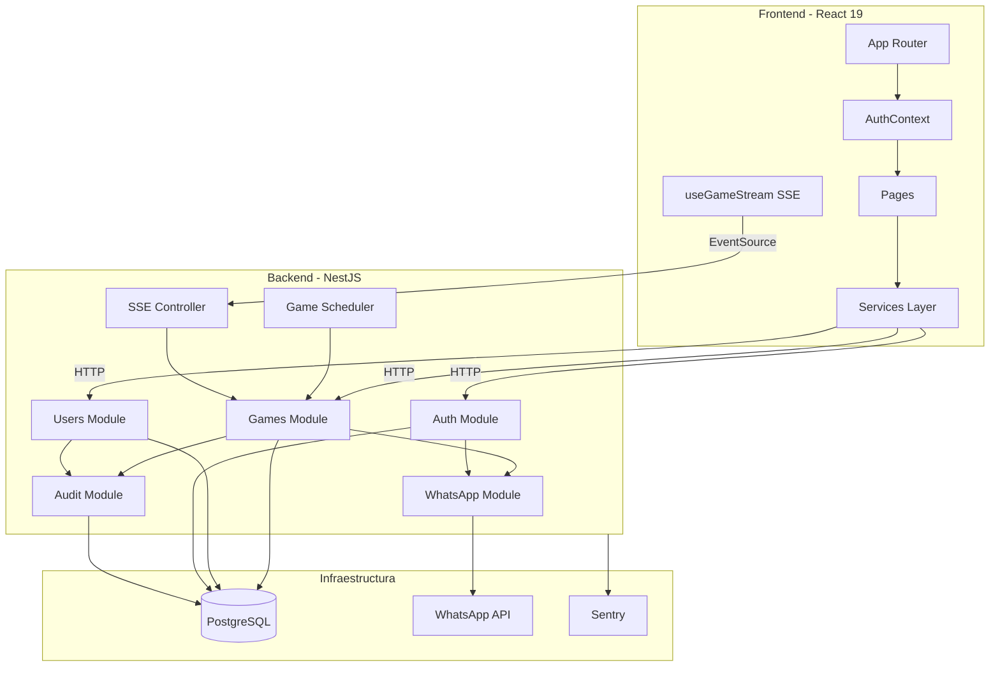
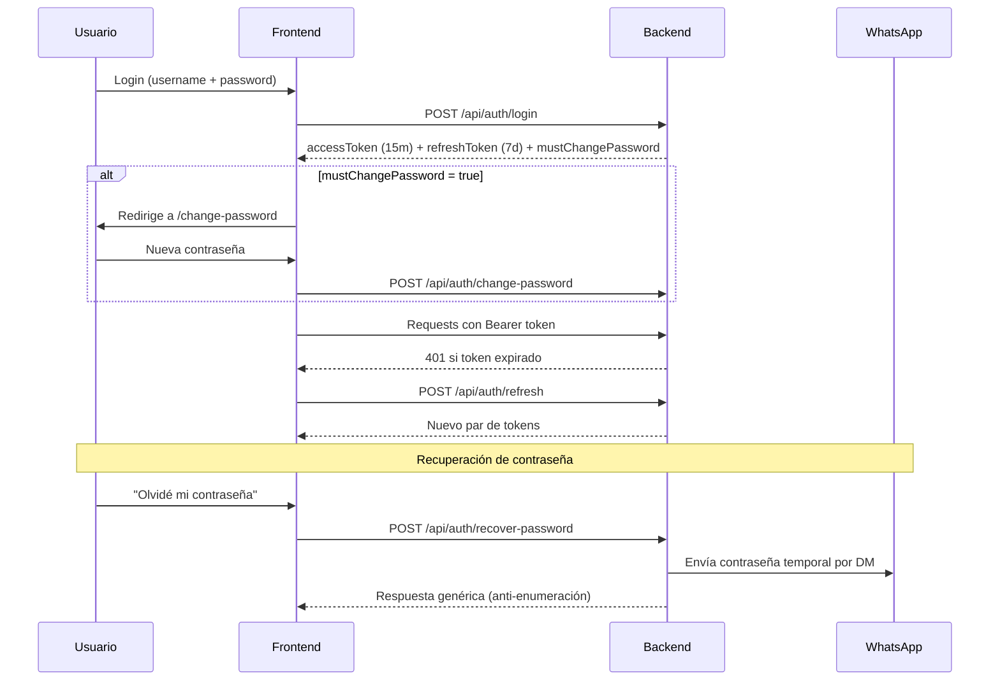
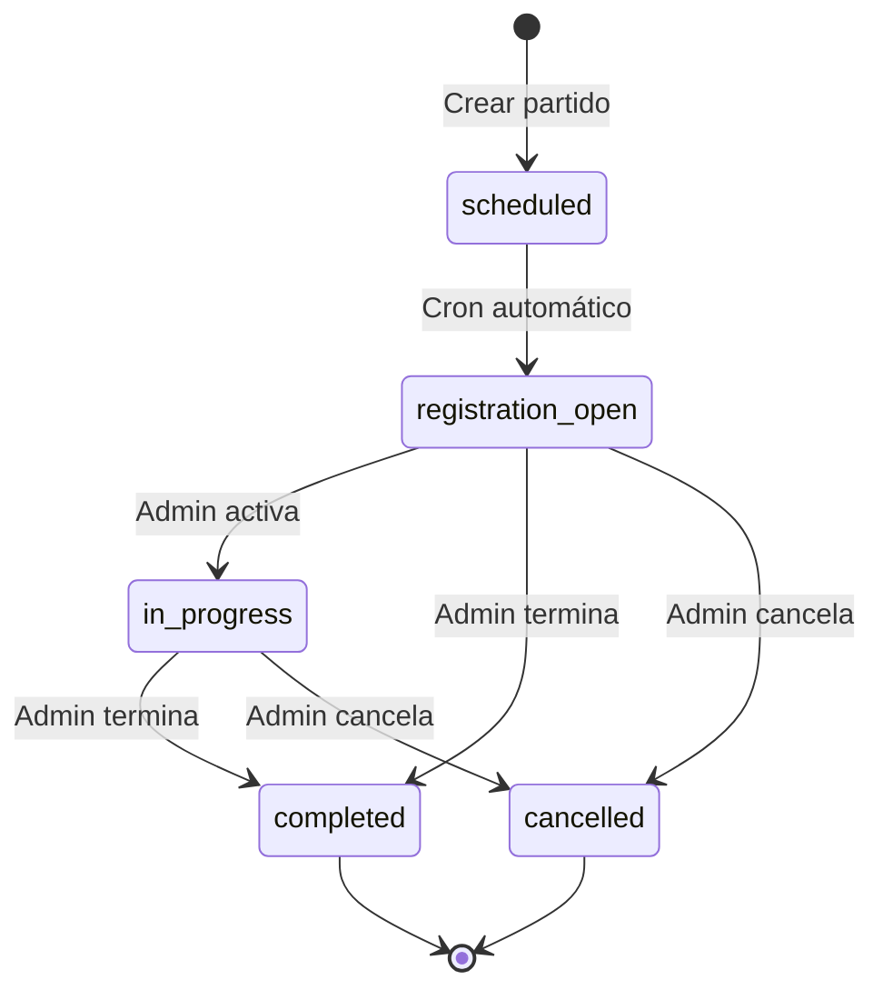
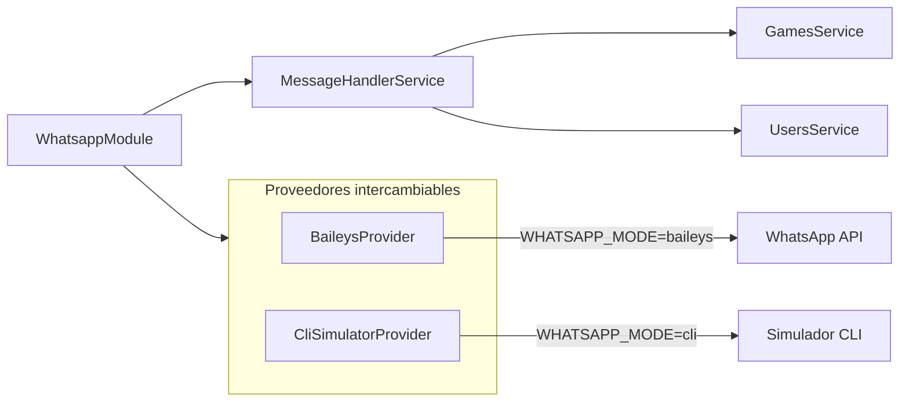
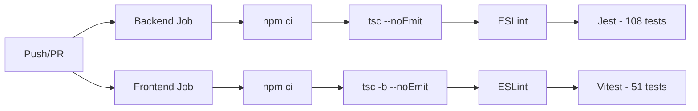

# Arquitectura — Zetas List

## Visión General

Aplicación full-stack monorepo para gestión de partidos de Volley Zetas Ingenio.
Frontend React + Backend NestJS + PostgreSQL + Bot de WhatsApp (Baileys).

```
zetas_list/
  frontend/           React 19 + TypeScript + Vite
  backend/            NestJS + Prisma + PostgreSQL
  .github/workflows/  CI pipeline (test, lint, typecheck)
  .husky/             Pre-commit hooks (lint)
  docker-compose.yml  Desarrollo local
  Makefile            Comandos de desarrollo
  railway.json        Configuración de producción
```

---

## Diagrama de Componentes



---

## Módulos del Backend

| Módulo | Responsabilidad |
|--------|----------------|
| `auth` | JWT login/refresh, cambio de contraseña, recuperación vía WhatsApp. `JwtUser` interface tipada en todos los controllers. |
| `users` | CRUD de usuarios (admin), edición de perfil (self), subida de foto de perfil (multer). |
| `games` | Partidos, registro con race-condition safety (serializable transactions), SSE en tiempo real, generación de reportes, mensajes WhatsApp. |
| `whatsapp` | Bot Z — comandos `@Z anotame`, `@Z lista`, `@Z terminar`, `@Z salirme`. Proveedores: Baileys (producción) y CLI simulator (desarrollo). |
| `audit` | Log inmutable de todas las mutaciones sobre partidos y usuarios. |
| `prisma` | Servicio global de base de datos con client singleton. |

---

## Flujo de Autenticación



---

## Real-time (SSE)

```
GET /api/games/:id/stream  →  EventSource en el frontend
Cada mutación al partido  →  GameEventsService.emit()
Frontend escucha          →  re-fetch del partido completo
Heartbeat cada 30s        →  mantiene conexión viva
Reconexión automática     →  exponential backoff hasta 30s
Token JWT                 →  pasado como query param (?token=...)
```

---

## Race Conditions en Registro

El mayor riesgo: múltiples usuarios hacen clic en "Anotame" simultáneamente.

```sql
BEGIN TRANSACTION ISOLATION LEVEL SERIALIZABLE;
  SELECT * FROM games WHERE id = $gameId FOR UPDATE;  -- lock
  -- contar spots disponibles
  -- insertar con posición correcta
COMMIT;
```

La constraint `UNIQUE(gameId, userId)` actúa como red de seguridad adicional.

El método `reorder()` valida que cada registration ID pertenezca al gameId dentro de la transacción.

---

## Ciclo de Vida de un Partido



- **`scheduled → registration_open`**: automático vía cron cada minuto. Envía mensaje a WhatsApp con link de registro.
- **`in_progress`**: admin activa manualmente.
- **`completed`**: admin via web ("Terminar") o WhatsApp (`@Z terminar`). Genera y envía el reporte automáticamente.
- **`cancelled`**: admin con razón obligatoria.

---

## Bot de WhatsApp (Z)

Todos los comandos requieren el prefijo `@Z`. Soporta sinónimos en español.

| Comando | Sinónimos | Quién | Acción |
|---------|-----------|-------|--------|
| `@Z anotame` | `meteme`, `apuntame`, `juego`, `voy`, `entro` | Miembro | Registra al usuario en el partido activo |
| `@Z salirme` | `sacame`, `quitame`, `no voy`, `no juego`, `salgo` | Miembro | Desregistra al usuario |
| `@Z lista` | `cupos`, `quienes van`, `cuantos` | Cualquiera | Muestra lista actual con spots disponibles |
| `@Z terminar` | `cerrar`, `finalizar`, `completar` | Solo admin | Genera reporte, completa el partido, lo envía al grupo |

### Arquitectura del módulo WhatsApp



`WHATSAPP_MODE=cli` activa el simulador CLI para desarrollo.
`WHATSAPP_MODE=baileys` usa la conexión real vía Baileys.

---

## Base de Datos

### Índices optimizados

| Tabla | Índice | Consulta que optimiza |
|-------|--------|-----------------------|
| `games` | `(status, registrationOpenAt)` | Cron scheduler (cada minuto) |
| `games` | `(gameDate, status)` | Verificación de conflicto al crear + filtros admin |
| `audit_logs` | `(gameId, createdAt)` | Modal de auditoría en detalle del partido |
| `game_registrations` | `UNIQUE(gameId, userId)` | Prevención de doble registro |
| `game_registrations` | `UNIQUE(gameId, position, isWaitingList)` | Integridad de posiciones |

### Relaciones y eliminación

- `GameRegistration → Game`: `onDelete: Cascade` (al borrar partido, se borran registros).
- `AuditLog → Game`: `onDelete: SetNull` (preserva log si se borra partido).

---

## Deployment (Railway)

```
railway.json → build con backend/Dockerfile (multi-stage)
  Stage 1: build frontend (React → dist/)
  Stage 2: build backend (NestJS → dist/)
  Stage 3: producción — backend sirve frontend estático + API

Servicios Railway:
  1. Backend (siempre encendido — necesario para Baileys + SSE)
  2. PostgreSQL (managed plugin)
```

Variables de entorno en Railway:
- `DATABASE_URL`, `JWT_SECRET`, `APP_URL`
- `WHATSAPP_MODE=baileys`, `WHATSAPP_GROUP_ID`
- `SENTRY_DSN`, `NODE_ENV=production`

---

## Desarrollo Local

### Requisitos

- Docker y Docker Compose
- Node.js 20+ (para lint/hooks en el host)

### Workflow con Makefile

```bash
make up              # Levanta DB + backend + frontend
make hooks           # Activa pre-commit hooks (una vez por clon)
make migrate name=x  # Crea migración Prisma
make seed            # Inserta datos iniciales
make test            # Corre tests en ambos sub-proyectos
make lint            # Lint en ambos sub-proyectos
```

### Volúmenes Docker

| Volumen | Uso |
|---------|-----|
| `pgdata` | Datos de PostgreSQL |
| `whatsapp_session` | Sesión de Baileys |
| `uploads` | Fotos de perfil subidas |

---

## CI Pipeline



- **Trigger**: push a `main` y `feat/phase-1-full-stack`, y todos los PRs.
- **Sin Docker/Postgres**: todos los tests son unitarios con mocks.
- **Pre-commit hooks**: lint solo para archivos staged (`.husky/pre-commit`).

---

## Testing

| Suite | Framework | Archivos | Tests |
|-------|-----------|----------|-------|
| Backend: `games.service.spec.ts` | Jest | generateReport, create, complete, removeRegistration, buildCounts | ~40 |
| Backend: `auth.service.spec.ts` | Jest | login, changePassword, recoverPassword | ~15 |
| Backend: `users.service.spec.ts` | Jest | create con contraseña default, conflictos, audit | ~10 |
| Backend: `message-handler.service.spec.ts` | Jest | regex patterns, handleMessage branches | ~43 |
| Frontend: `parser.test.ts` | Vitest | normalize, tokenize, assemble, parseMessage | 51 |

Todos los tests backend mockean `PrismaService`, `AuditService`, `GameEventsService`, `WhatsappService`, y `JwtService` vía `@nestjs/testing`.

---

## Seguridad

| Medida | Implementación |
|--------|---------------|
| Auth | JWT con access (15m) + refresh (7d) tokens. `mustChangePassword` forzado para usuarios nuevos. |
| Contraseñas | bcrypt con 12 rounds. Contraseña por defecto para usuarios creados por admin con cambio obligatorio. |
| Recuperación | Contraseña temporal enviada por WhatsApp DM. Respuesta genérica anti-enumeración de usuarios. |
| Validación | `ValidationPipe` global con `whitelist` y `forbidNonWhitelisted`. DTOs con `class-validator`. |
| CORS | Configurado por variable `FRONTEND_URL`. |
| Uploads | Solo imágenes, máximo 5MB, nombres UUID, servidos desde `/uploads/`. |
| Errores 5xx | `AllExceptionsFilter` captura en Sentry y loguea. |
| Reorder | Valida pertenencia de cada registro al partido dentro de la transacción. |

---

## Invariantes del Sistema

1. **Audit logging obligatorio**: toda mutación sobre registros de partidos debe llamar `AuditService.log()`.
2. **registeredAt siempre del servidor**: nunca confiar en timestamps del cliente.
3. **Race conditions**: toda modificación de posiciones o conteo de cupos usa `FOR UPDATE` + transacción serializable.
4. **Textos al usuario**: siempre en español.
5. **Tipado estricto**: `strict: true` en TypeScript, `JwtUser` interface en todos los controllers.
6. **WhatsApp no bloquea**: errores de envío se logean pero no interrumpen el flujo principal.

---

## Roles

| Rol | Capacidades |
|-----|------------|
| `admin` | Todo: crear partidos, gestionar usuarios, ver historial, terminar partidos, comandos WhatsApp admin |
| `member` | Ver partido activo, registrarse/desregistrarse, editar perfil propio |
