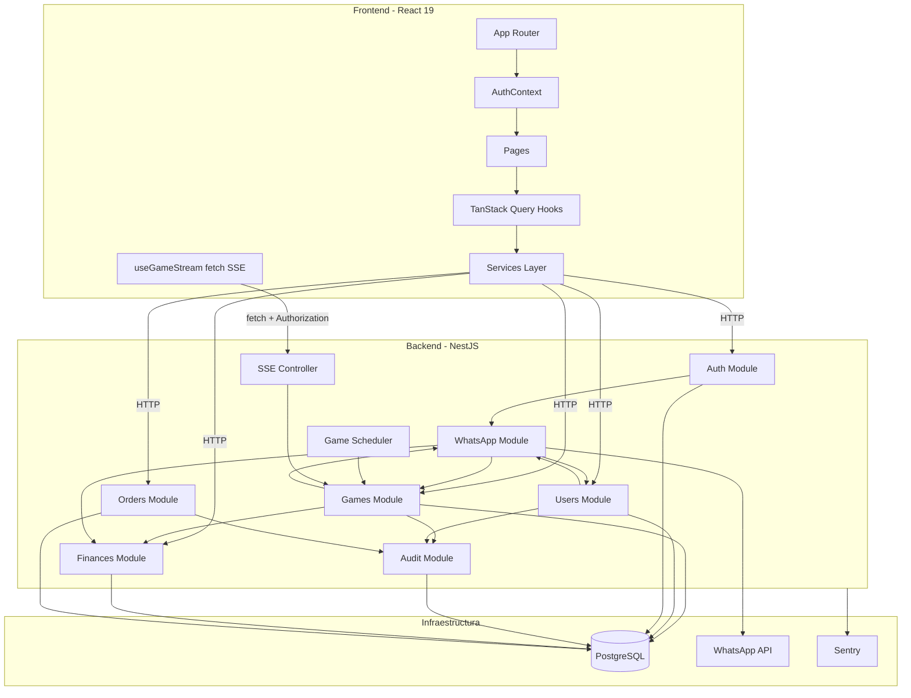
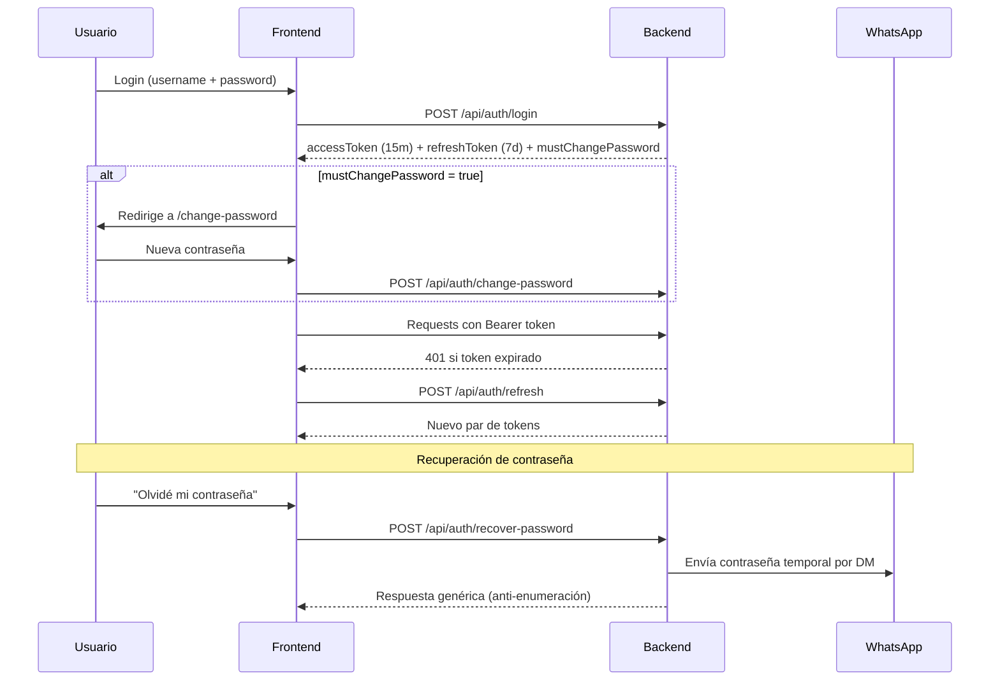
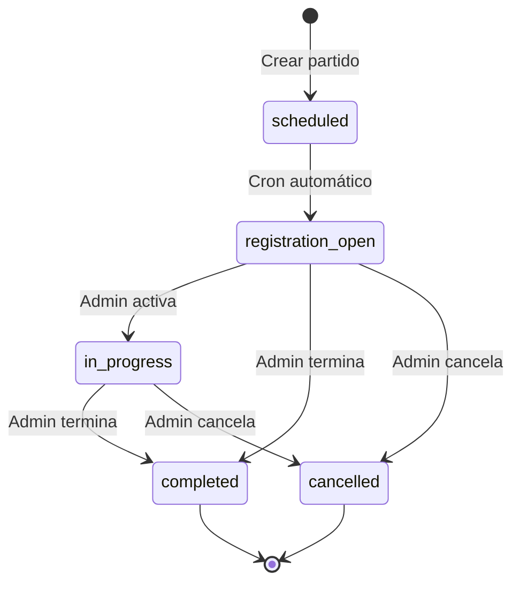
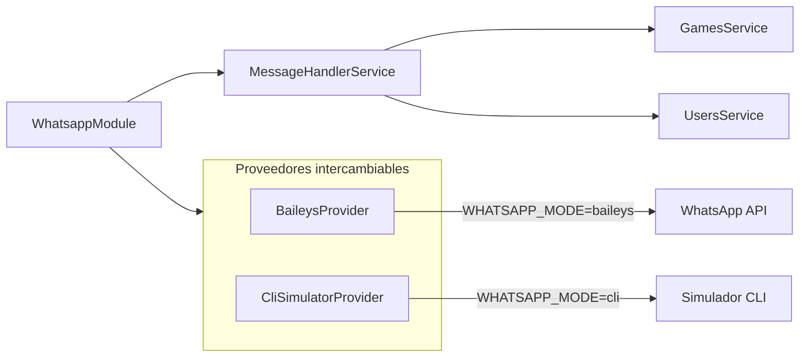
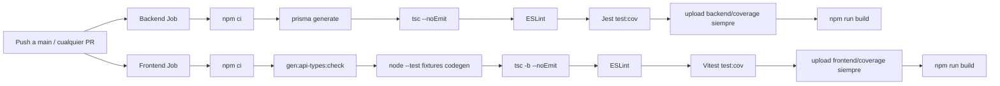

# Arquitectura — Zetas List

## Visión General

Aplicación full-stack monorepo para gestión de partidos de Volley Zetas Ingenio.
Frontend React + Backend NestJS + PostgreSQL + Bot de WhatsApp (Baileys).

```
zetas_list/
  frontend/           React 19 + TypeScript + Vite
  backend/            NestJS + Prisma + PostgreSQL
  scripts/            Codegen de tipos compartidos
  video/              Video promocional (Remotion) — no forma parte de la app
  .github/workflows/  CI pipeline (install, codegen, typecheck, lint, coverage y build)
  .husky/             Pre-commit hooks (lint de archivos staged)
  docker-compose.yml  Desarrollo local
  Dockerfile          Build de producción (multi-stage, en la raíz)
  Makefile            Comandos de desarrollo
  railway.json        Configuración de producción
```

"Monorepo" acá significa dos paquetes npm independientes en un mismo repo, cada
uno con su propio `package.json` y `package-lock.json`. No hay workspaces ni
herramientas de monorepo.

---

## Diagrama de Componentes



---

## Módulos del Backend

| Módulo | Responsabilidad |
|--------|----------------|
| `auth` | JWT login/refresh, cambio de contraseña, recuperación vía WhatsApp. `JwtUser` interface tipada en todos los controllers. |
| `users` | CRUD de usuarios (admin), edición de perfil (self), subida de foto de perfil (multer). |
| `games` | `GamesService` coordina `RegistrationService`, `WaitlistService`, `ConfirmationService`, `GameLifecycleService` y `GameQueryService`; transacciones serializables, SSE, scheduler y notificaciones quedan en servicios dedicados. |
| `whatsapp` | `MessageHandlerService` despacha lectura a `InfoCommandsService` y mutaciones a `MutatingCommandsService`; listeners consumen eventos de dominio y providers Baileys/CLI aíslan el transporte. |
| `audit` | Log inmutable de todas las mutaciones sobre partidos y usuarios. |
| `prisma` | Servicio global de base de datos con client singleton. |

---

## Flujo de Autenticación



---

## Real-time (SSE)

```
GET /api/games/:id/stream  →  fetch streaming en el frontend
Cada mutación al partido  →  GameEventsService.emit()
Frontend escucha          →  re-fetch del partido completo
Heartbeat cada 30s        →  mantiene conexión viva
Reconexión automática     →  exponential backoff hasta 30s
Token JWT                 →  header Authorization: Bearer (nunca en URL)
```

`useGameStream` parsea frames SSE (incluidos `\r\n` y múltiples líneas `data:`),
aborta el reader al desmontar y reconecta con backoff exponencial acotado.

---

## Estado remoto y cache frontend

Los hooks `use*Query` y `use*Mutations` encapsulan TanStack Query. Las claves
centralizadas en `lib/query-client.ts` evitan caches divergentes. Una mutación
invalida el detalle y las listas relacionadas; los eventos SSE invalidan el
detalle del partido para que cualquier consumidor comparta el refetch. Al
cerrar sesión se limpia primero la cache persistida de sesión y luego los tokens,
evitando que datos de un usuario sobrevivan al siguiente login.

---

## Race Conditions en Registro

El mayor riesgo: múltiples usuarios hacen clic en "Anotame" simultáneamente.

```sql
BEGIN TRANSACTION ISOLATION LEVEL SERIALIZABLE;
  SELECT * FROM games WHERE id = $gameId FOR UPDATE;  -- lock
  -- contar spots disponibles
  -- insertar con posición correcta
COMMIT;
```

La constraint `UNIQUE(gameId, userId)` actúa como red de seguridad adicional.

El método `reorder()` valida que cada registration ID pertenezca al gameId dentro de la transacción.

---

## Ciclo de Vida de un Partido



- **`scheduled → registration_open`**: automático vía cron cada minuto. Envía mensaje a WhatsApp con link de registro.
- **`in_progress`**: admin activa manualmente.
- **`completed`**: admin via web ("Terminar") o WhatsApp (`@Z terminar`). Genera y envía el reporte automáticamente.
- **`cancelled`**: admin con razón obligatoria.

---

## Bot de WhatsApp (Z)

Todos los comandos requieren el prefijo `@Z`. Soporta sinónimos en español.

| Comando | Sinónimos | Quién | Acción |
|---------|-----------|-------|--------|
| `@Z anotame` | `meteme`, `apuntame`, `juego`, `voy`, `entro` | Miembro | Registra al usuario en el partido activo |
| `@Z salirme` | `sacame`, `quitame`, `no voy`, `no juego`, `salgo` | Miembro | Desregistra al usuario |
| `@Z lista` | `cupos`, `quienes van`, `cuantos` | Cualquiera | Muestra lista actual con spots disponibles |
| `@Z terminar` | `cerrar`, `finalizar`, `completar` | Solo admin | Genera reporte, completa el partido, lo envía al grupo |

### Arquitectura del módulo WhatsApp



`WHATSAPP_MODE=cli` activa el simulador CLI para desarrollo.
`WHATSAPP_MODE=baileys` usa la conexión real vía Baileys.

---

## Base de Datos

### Índices optimizados

| Tabla | Índice | Consulta que optimiza |
|-------|--------|-----------------------|
| `games` | `(status, registrationOpenAt)` | Cron scheduler (cada minuto) |
| `games` | `(gameDate, status)` | Verificación de conflicto al crear + filtros admin |
| `audit_logs` | `(gameId, createdAt)` | Modal de auditoría en detalle del partido |
| `game_registrations` | `UNIQUE(gameId, userId)` | Prevención de doble registro |
| `game_registrations` | `UNIQUE(gameId, position, isWaitingList)` | Integridad de posiciones |

### Relaciones y eliminación

- `GameRegistration → Game`: `onDelete: Cascade` (al borrar partido, se borran registros).
- `AuditLog → Game`: `onDelete: SetNull` (preserva log si se borra partido).

---

## Deployment (Railway)

```
railway.json → build con ./Dockerfile en la raíz del repo (multi-stage)
  Stage 1: build frontend (React → frontend/dist/)
  Stage 2: build backend (NestJS → dist/)
  Stage 3: producción — backend sirve frontend estático (public/) + API

Servicios Railway:
  1. Backend (siempre encendido — necesario para Baileys + SSE)
  2. PostgreSQL (managed plugin)
```

Migraciones: `preDeployCommand` corre `npx prisma migrate deploy` antes de
levantar la nueva versión. Healthcheck en `/health`.

Variables de entorno en Railway:
- `DATABASE_URL`, `JWT_SECRET`, `APP_URL`, `FRONTEND_URL`
- `WHATSAPP_MODE=baileys`, `WHATSAPP_GROUP_ID`
- `SENTRY_DSN`, `NODE_ENV=production`

El backend valida todas estas variables al arrancar (`src/config/env.ts`); si
falta alguna obligatoria el proceso termina en el bootstrap en vez de fallar
más tarde en runtime.

---

## Desarrollo Local

### Requisitos

- Docker y Docker Compose
- Node.js 20+ (para lint/hooks en el host)

### Workflow con Makefile

```bash
make up              # Levanta DB + backend + frontend
make hooks           # Activa pre-commit hooks (una vez por clon)
make migrate name=x  # Crea migración Prisma
make seed            # Inserta datos iniciales
make test            # Corre tests en ambos sub-proyectos
make test-cov        # Coverage + thresholds en ambos paquetes
make lint            # Lint en ambos sub-proyectos
make gen-types       # Regenera los enums compartidos del frontend
make check           # Gate completo equivalente a CI
```

### Volúmenes Docker

| Volumen | Uso |
|---------|-----|
| `pgdata` | Datos de PostgreSQL |
| `whatsapp_session` | Sesión de Baileys |
| `uploads` | Fotos de perfil subidas |

---

## CI Pipeline



- **Trigger**: push a `main` y todos los PRs.
- **Permisos**: solo lectura de contenidos; runs anteriores del mismo ref/PR se cancelan.
- **Runtime**: Node 20, lockfiles instalados exclusivamente con `npm ci`.
- **Artifacts**: coverage backend/frontend se publica aun si falla un gate y se retiene 14 días.
- **Sin Docker/Postgres**: todos los tests son unitarios con mocks.
- **Pre-commit hooks**: lint solo de los archivos staged (`.husky/pre-commit`).
- **Drift de tipos**: el job de frontend falla si `api-types.gen.ts` no coincide
  con `schema.prisma`.

---

## Testing

Las suites de Jest y Vitest corren sin Docker ni Postgres. El número de pruebas
y la cobertura vigentes se publican en la salida de CI; ambos paquetes aplican
umbrales globales mediante `test:cov`.

| Área | Cobertura principal |
|------|---------------------|
| WhatsApp | regexes de comandos, dispatch, handlers, listeners y utilidades de JID |
| Partidos | registro, promoción, confirmaciones, reportes, scheduler y escenarios stateful |
| Usuarios y auth | CRUD, permisos, contraseñas, login, refresh y cumpleaños |
| Pedidos y finanzas | catálogo, pedidos, estados, transacciones, multas y dashboard |
| HTTP | rutas principales, validación de DTOs y autorización con JWT/roles |
| Frontend | parser, servicios, hooks, componentes y flujos de páginas con Testing Library |

Las suites `src/test/e2e/*.spec.ts` prueban el wiring HTTP de auth, permisos y
controllers con la aplicación Nest en memoria; no requieren Postgres ni Docker.
El codegen tiene fixtures independientes para enums, nullability, tipos de fecha,
JSON, omisiones sensibles y escalares Prisma no soportados.

Los tests unitarios mockean `PrismaService`, `AuditService`, `GameEventsService`,
`WhatsappService`, `FinancesService` y `JwtService` vía `@nestjs/testing`.

**Tests de escenario** (`*.scenario.spec.ts`): usan un Prisma en memoria
(`games/testing/in-memory-prisma.ts`) que mantiene estado real entre llamadas,
para reproducir flujos donde el estado evoluciona (llenar la lista, pasar el
cutoff, promociones en cascada, timeouts de confirmación).

---

## Seguridad

| Medida | Implementación |
|--------|---------------|
| Auth | JWT con access (15m) + refresh (7d) tokens. `mustChangePassword` forzado para usuarios nuevos. |
| Contraseñas | bcrypt con 12 rounds. Contraseña por defecto para usuarios creados por admin con cambio obligatorio. |
| Recuperación | Contraseña temporal enviada por WhatsApp DM. Respuesta genérica anti-enumeración de usuarios. |
| Validación | `ValidationPipe` global con `whitelist` y `forbidNonWhitelisted`. DTOs con `class-validator`. |
| CORS | Configurado por variable `FRONTEND_URL`. |
| Uploads | Solo imágenes, máximo 5MB, nombres UUID, servidos desde `/uploads/`. |
| Errores 5xx | `AllExceptionsFilter` captura en Sentry y loguea. |
| Reorder | Valida pertenencia de cada registro al partido dentro de la transacción. |

---

## Invariantes del Sistema

1. **Audit logging obligatorio**: toda mutación sobre registros de partidos debe llamar `AuditService.log()`.
2. **registeredAt siempre del servidor**: nunca confiar en timestamps del cliente.
3. **Race conditions**: toda modificación de posiciones o conteo de cupos usa `FOR UPDATE` + transacción serializable.
4. **Textos al usuario**: siempre en español.
5. **Tipado estricto**: `strict: true` en TypeScript, `JwtUser` interface en todos los controllers.
6. **WhatsApp no bloquea**: errores de envío se logean pero no interrumpen el flujo principal.

---

## Roles

| Rol | Capacidades |
|-----|------------|
| `admin` | Todo: crear partidos, gestionar usuarios, finanzas, pedidos, historial |
| `ayudante` | Gestiona el partido del día (promover, sacar, asistencia, pagos, terminar) pero no administra usuarios ni finanzas |
| `member` | Ver partido activo, anotarse/salirse, invitar, editar su perfil |

`admin` y `ayudante` comparten la constante `GAME_MANAGERS`
(`common/constants/roles.ts`), que es la que usan `@Roles(...)` en
`GamesController` y los chequeos de permisos del bot. Cualquier endpoint que
gestione el partido del día debe usar `GAME_MANAGERS`, no `Role.admin` a secas.
